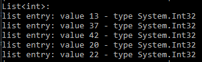
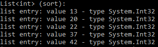
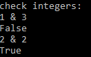
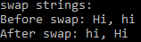

# IW911 Modellbasierte Software Entwicklung

Projekt zur Voresung Modellbasierte Software Entwicklung WS 2021/2022

scka1066 - 74226

# Generics in C#

In C# stehen Generics seit der Version 2.0 des .NET Framework zur Verfügung.
Sie führen den Typ-Parameter T in Methoden, Klassen und Interfaces ein.

Weitere allgemeine Informationen über Generics sind --------hier---------- zu finden. 

## Beispiele für Generics in C#

| Generic class             | Beschreibung |
|---|---|
| Dictionary<TKey, TValue>  | Stellt eine Auflistung von Schlüsseln und Werten dar. |
| HashSet < T > 	        | Stellt eine Menge von Werten dar. |
| List < T >                | Stellt eine stark typisierte Liste von Objekten dar, auf die über einen Index zugegriffen werden kann. Stellt Methoden zum Durchsuchen, Sortieren und Bearbeiten von Listen bereit. |
| Queue < T >               | Stellt eine FIFO-Auflistung (First-In-First-Out) von Objekten dar. |
| Stack < T >               | Stellt eine LIFO (Last-In-First-Out)-Sammlung variabler Größe von Instanzen desselben angegebenen Typs dar. |

## Beispiel für eine Implementation bereitgestellter Generics

Hier wird mit hilfe der oben bereits erwähnten generischen Klasse "List< T >" eine Liste erstellt, die Werte vom Typ Integer beinhaltet.
Hierzu wird beim Aufruf der Typ-Parmeter T durch den gewünschten Type der in der Liste gehaltenen Objekte ersetzt (hier Integer).

Konkret wird im folgenden Code-Auszug eine integer-Liste angelegt und diese dann mit Werten gefüllt.
Anschließend wird in der Konsole für jeden Wert in der Liste eine Zeile in der Konsole ausgegeben.

```C#
    // Creating a list
    // using List<T> class containing integer values
    List<int> numberList = new List<int>();
    // adding integer values to the list
    numberList.Add(13);
    numberList.Add(37);
    numberList.Add(42);
    numberList.Add(20);
    numberList.Add(22);
	
    foreach (var element in numberList)
    {
        Console.WriteLine("list entry: value {0} - type {1}",	element, element.GetType());
    }
```
Die Ausgabe sieht dann folgendermaßen aus:



Mit dieser Liste kann von haus aus viel getan werden.
Beispielsweise lässt sie sich sortieren.
Hierzu muss die "sort()" Methode der Klasse "List" aufgerufen werden, wie im Folgenden dargestellt.

```C#
    numberList.Sort();
    foreach (var element in numberList)
    {
        Console.WriteLine("list entry: value {0} - type {1}",	element, element.GetType());
    }
```

Die Ausgabe sieht dann folgendermaßen aus:



Die genaue Implemetierung der Generischen Klasse "List< T >" ist [hier](https://referencesource.microsoft.com/#mscorlib/system/collections/generic/list.cs,cf7f4095e4de7646) zu finden.

## Beispiel eigene Generische Klasse in C#
Natürlich besteht auch die Möglichkeit eigene generische Klassen oder Methoden zu schreiben.

### Check< T >
Als erstes Beispiel hier die recht einfache Klasse "Check< T >", welche zwei Werte eines Typs entgegen nimmt und miteinander vergleicht.

Sind beide Werte gleich und nicht "null", wird "true" zurückgegeben, ansonsten "false".

```C#
class Check<T>
{
    public bool Compare(T a, T b)
    {
        if (a != null && b!= null && a.Equals(b))
        {
            return true;
        }
        else
        {
            return false;
        }
    }
}
```

Der folgende Code initialisiert die Klassse "Check< T >", so dass Integer Werte vergleichen werden können.
Anschließend werden die Werte "1" und "3" mit einander vergeichen und das Ergebnis in "result" gespeichert.

```C#
    var checkInt = new Check<int>();
    bool result = checkInt.Compare(1, 3);
```
Hier die implementierung zusammen mit Etwas Code zur visuellen Darstellung der Ein und Ausgabe in der Kommandozeile: 
```C#
    Console.WriteLine("check integers:");
    var checkInt = new Check<int>();
    Console.WriteLine("1 & 3");
    Console.WriteLine(checkInt.Compare(1, 3));
    Console.WriteLine("2 & 2");
    Console.WriteLine(checkInt.Compare(2, 2));
```
Die vom obigen Code generierte Ausgabe siet dann aus wie folgt:



### Swapper

Als zweites Beispiel dient hier eine statische Klasse, deren generische Methode "SwapIt" zwei Werte entgegen nimmt und vertauscht.

```C#
static class Swapper
{
    internal static void SwapIt<T>(ref T a, ref T b)
    {
        T temp;
        temp = a;
        a = b;
        b = temp;
    }
}
```

Bei der Methode "SwapIt" ist es nicht nötig den Typ zu spezifizieren.

Die referenz der Variable oder des Objekts wird übergeben und vertauscht.

Eine Mögliche Implementierung mit Kommandozeilenausgabe ist im folgenden Code-Ausschnitt zu sehen:

```C#
    string a = "Hi";
    string b = "hi";
    Console.WriteLine("Before swap: {0}, {1}", a, b);
    Swapper.SwapIt(ref a, ref b);
    Console.WriteLine("After swap: {0}, {1}", a, b);
```
Die Ausgabe sieht bei Ausführung dann folgendermaßen aus:



Weitere Beispiele zur implementierung von bereits gebenen oder eigens erstellten Generics sind der Codebasis zu entnehmen.
Die Ausgabe kann bei Ausführen des Projekts in der Kommandozeile betrachtet werden.
Zur Auswahl der einzelnen Beispiele wird ein simples Menü genutzt.

### Hinweis

Es ist nicht nötig sich an den Buchstaben T zu halten.

Der Buchstabe T hat sich nur zur konvention geworden, da er für das Wort "Type" steht.

Es kann jeder buchstabe an Stelle von T genutzt werden.

Auch mehrere Parameter können Spezifiziert werden, werden sie durch Komma getrennt (z.B. <T, K, P, L>) und können dann als Parameter an der gewünschten Stelle genutzt werden.

# Vorteile von Generics
Durch das Verwenden von Generics wird Code wiederverwendbar, typsicher und hat eine bessere Performance zur Laufzeit, da, wenn korrekt verwendet, keine Kosten für Type Casten oder Boxing/Unboxing anfallen, was zur Folge hat, dass keine Typumwandlungsfehler zur Laufzeit Produziert werden. Der Compiler von C# kann Probleme mit ungültigem Casting zur Kompilierzeit erkennen.

## Wiederverwendbarkeit
Wiederverwendbarkeit bei Generics in C# meint, dass es möglich ist, eine Methode oder Klasse zu erstellen, die mit unterschiedlichen Typen an unterschiedlichen Stellen verwendet werden kann.

Mit Generics schreibt man so statt vieler Methoden die die selbe Funktion haben, nur eine Methode, welche einen Parameter des Typs T akzeptiert. In dieser wird dann die zuvor erwähnte Funktion implementiert, welche dann als Rückgabe "void", also nichts, oder einen konkreten Typen (String, int, bool, ...) oder sogar T hat.

## Typsicherheit & Performance
Da der Compiler von C# bereits beim compailieren Fehler aus gibt, sollte ein Problem mit unsicheren Casts bestehen, und den Prozess der Compailierung abbricht, wird während der Laufzeit kein solcher Fehler auftreten und das Programm verlangsmen oder durch Fehler abstürzen lassen.

## Boxing / Unboxing

- Boxing bezeichnet den Prozess, einen Typ zu einem Objekt zu konvertieren.
- Unboxing bezeichnet den Prozess, ein Objekt zu einem Typ zu konvertieren.

Boxing und Unboxing sind Rechenintensive Operationen, die es zu vermeiden gilt, soll der Code performant sein.
Durch Verwendung von Generics wird das Boxing und Unboxing umgangen, da im Code mit dem Parametertyp T gearbeitet wird, für den der Compiler beim Compailieren mit dem konkreten Typ ersetzt, sodass der Boxing-Vorgang nicht zur Laufzeit durchgeführt werden muss.

# Quellen
- [codingame - demystifying c# generics](https://www.codingame.com/playgrounds/2290/demystifying-c-generics)
- [system.collections.generic](https://docs.microsoft.com/en-us/dotnet/api/system.collections.generic?view=net-6.0)
- [Generische Typparameter](https://docs.microsoft.com/de-de/dotnet/csharp/programming-guide/generics/generic-type-parameters)
- [referencesource.microsoft](https://referencesource.microsoft.com)
- [tutorialsteacher](https://www.tutorialsteacher.com/csharp/csharp-generics)
